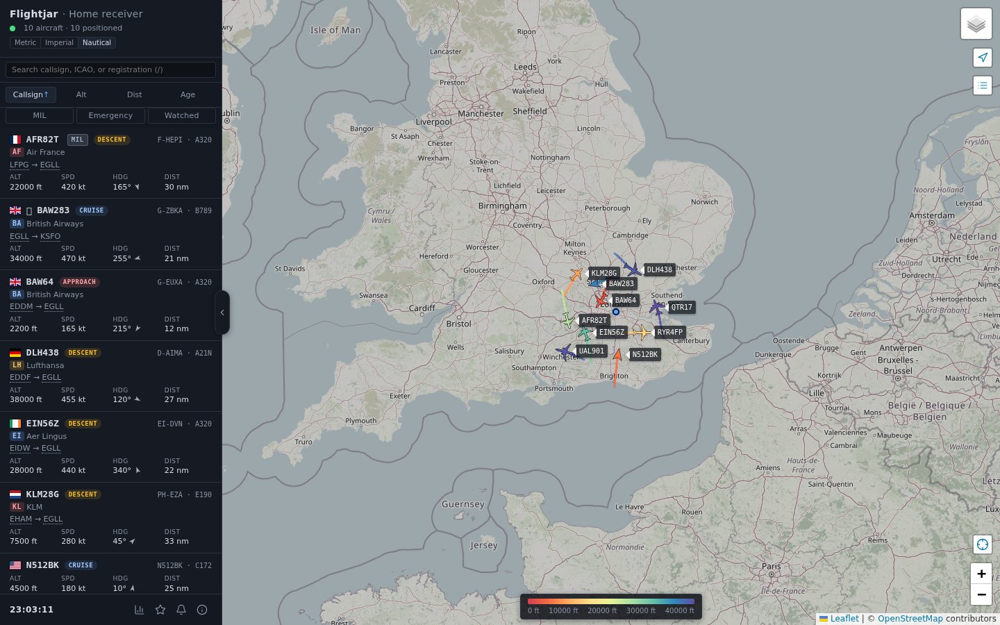
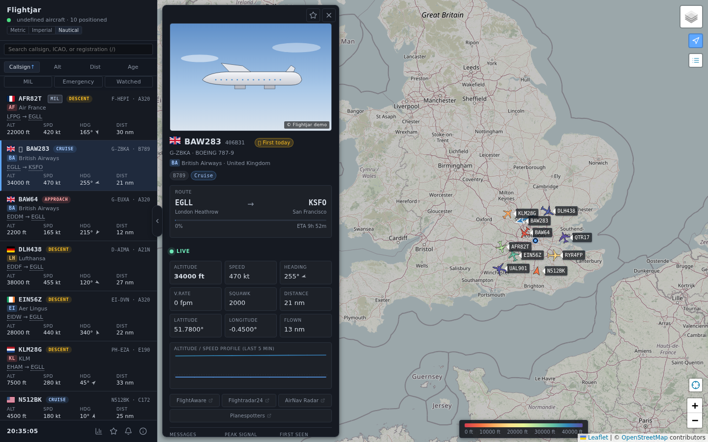
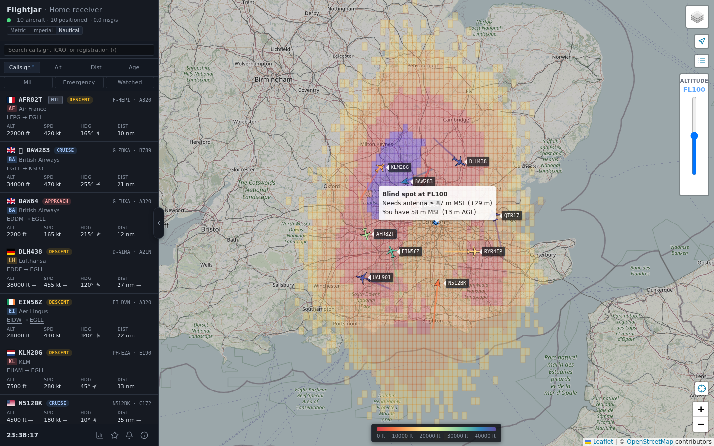
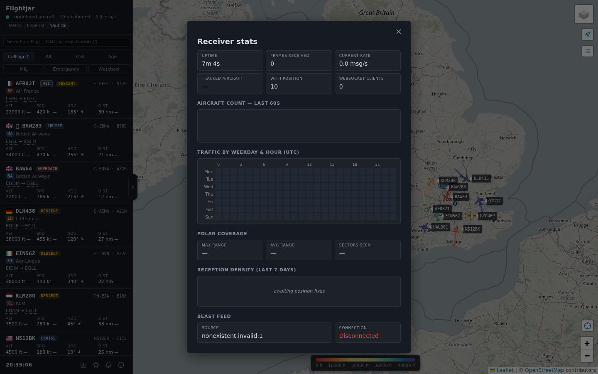
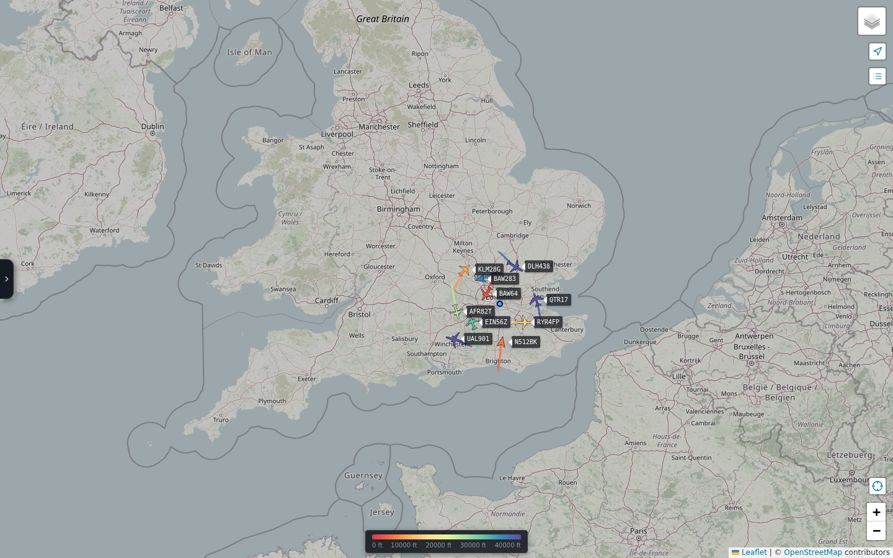
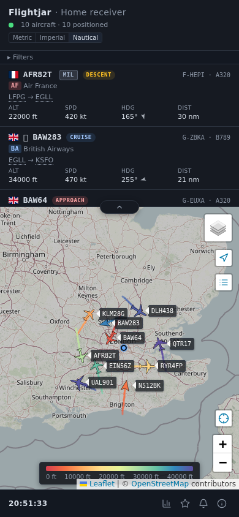
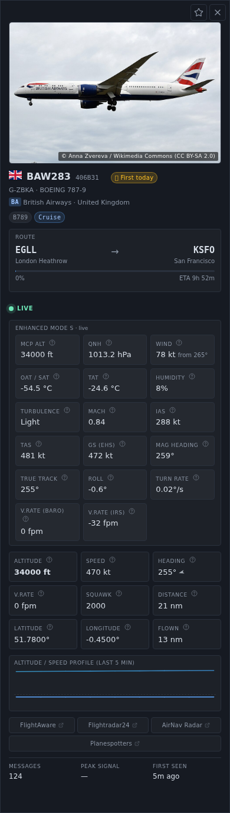
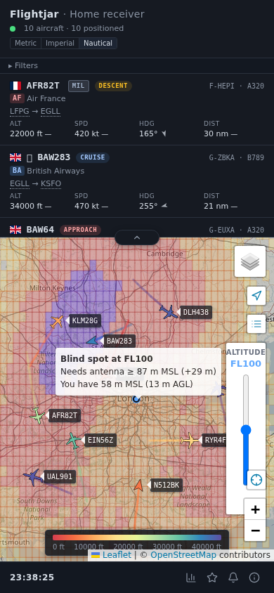
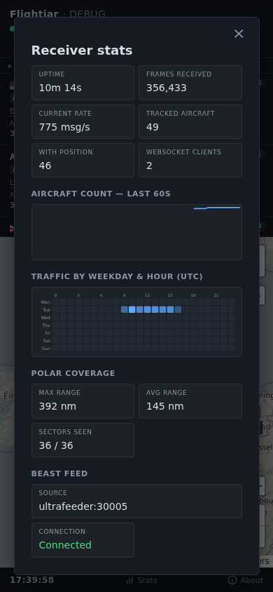
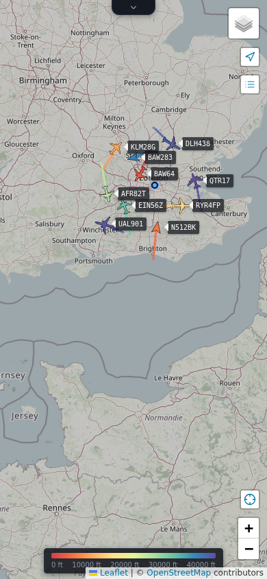

# Flightjar

A self-hosted flight tracker for a local ADS-B receiver: a live map
with per-type silhouettes and altitude-coloured trails, a detail panel
carrying each aircraft's photo, route, progress + ETA, METAR at origin
and destination, flight phase, and alliance, a sortable / searchable
sidebar, receiver-coverage stats, and a durable JSONL log of every
message for later analysis.

It reads the BEAST feed from a running readsb, dump1090, or
ultrafeeder — point it at whatever's already decoding ADS-B on your
network, no extra decoder or signup required. Enrichments (routes,
photos, weather, airline metadata) come from free public sources,
are cached on disk, and are individually feature-gated for offline
or privacy-conscious deployments.

| Overview | Detail panel | Terrain blackspots |
| -------- | ------------ | ------------------ |
|  |  |  |

| Stats dialog | Compact mode |
| ------------ | ------------ |
|  |  |

On mobile, the sidebar stacks above the map and the detail panel slides
up as a fullscreen sheet:

| Overview | Detail panel | Terrain blackspots |
| -------- | ------------ | ------------------ |
|  |  |  |

| Stats dialog | Compact mode |
| ------------ | ------------ |
|  |  |


## What you get

- **Live map** at `http://<host>:8080/` with per-type plane silhouettes
  sourced from the [tar1090](https://github.com/wiedehopf/tar1090) SVG
  shape set (GPL-2.0+; covers ~450 ICAO type codes, with a generic
  arrow for anything unmapped), altitude-coloured trails showing each
  aircraft's recent altitude history, and a toggleable callsign label
  on each one.
- **Detail panel** — click any aircraft and a floating card opens with
  a photo of the plane (when we have one), its registration, type,
  operator, country flag, full route with airport names, and a full
  telemetry grid (altitude, speed, heading, vertical rate, squawk,
  distance, lat/lon, age). The panel auto-follows the plane while it's
  open and closes with the × button, the `Esc` key, or a click on empty
  map. On desktop it floats over the map so the map isn't resized;
  on mobile it overlays the whole viewport.
- **Sidebar list** of currently tracked aircraft, sortable by callsign,
  altitude, distance from the receiver, or age. Each row shows the
  registration country flag, callsign, tail/type, and live telemetry.
  Hover a plane on the map to highlight its row, and vice-versa.
- **Unit switcher** — Metric, Imperial, or Nautical — applied across
  altitude, speed, vertical rate, and distance. Your choice is remembered.
- **A record of every message** written as JSON Lines to a file on disk,
  rotated daily.
- **Optional privacy** — you can fuzz the displayed receiver location so
  sharing screenshots doesn't pin your home address on a map.
- **Optional site name** shown in the header and browser tab so you can
  tell multiple installs apart at a glance.
- **Aircraft DB enrichment** — each aircraft is tagged with its
  registration and type (e.g. `G-ABCD · BOEING 737-800`), so the detail
  panel and sidebar show the actual tail number rather than just the
  ICAO hex.
- **adsbdb enrichment** — origin / destination by callsign, operator
  name, country, and an aircraft photo, all looked up from
  [adsbdb.com](https://www.adsbdb.com/) (a free community-maintained
  API; no signup required). Routes render as `EGLL → KJFK` in the
  sidebar and as a full ticket (with airport names) in the detail panel.
  Lookups are cached server-side for 12h (routes) / 30 days (tails).
- **Flight progress + ETA** — when a flight has a known route, the detail
  panel shows a great-circle progress bar between origin and destination
  along with a live ETA at the current groundspeed. Hidden automatically
  when the aircraft is on the ground or too slow for the number to be
  meaningful.
- **At-a-glance flight state** — each aircraft is auto-classified into
  `taxi` / `climb` / `cruise` / `descent` / `approach` based on its
  vertical rate, altitude, and (when the route is known) distance to the
  destination. The label appears as a coloured chip in the sidebar and
  the detail panel. Heavies and Super-category aircraft (A380, B748 …)
  also get a warmer accent on the category badge so you can scan by wake
  class without reading the label.
- **Signal strength indicator** — each sidebar row carries a small four-bar
  reception quality indicator driven by the peak signal byte from the
  BEAST feed, turning green for strong signals and red for faint ones.
- **Airline IATA + alliance** — the airline row on each sidebar entry
  carries the IATA code as a small monospace tag, and rows for the three
  major alliances (Star, oneworld, SkyTeam) get a coloured left-border
  accent. Backed by the [OpenFlights](https://openflights.org/data.html)
  airline database baked into the image at build time; no runtime
  network calls.
- **METAR weather at origin / destination** — when a flight has a known
  route, the detail panel surfaces a compact one-line METAR summary
  (wind, visibility, cloud cover) for each end, with the raw METAR on
  hover. Pulled live from the free
  [aviationweather.gov](https://aviationweather.gov/) API and cached
  server-side for 10 min. Disable with `METAR_WEATHER=0`.
- **Enhanced Mode S air data** — when a plane is in Mode S interrogation
  range of a ground SSR, the detail panel surfaces everything decoded from
  its Comm-B replies: autopilot-selected altitude (MCP/FCU + FMS) and QNH
  setting (BDS 4,0); wind speed and direction, static air temperature (OAT),
  static pressure, humidity, and turbulence (BDS 4,4); roll angle, true
  track, true airspeed, ground speed, and turn rate (BDS 5,0); Mach,
  indicated airspeed, magnetic heading, and baro / inertial vertical rates
  (BDS 6,0). Total air temperature (TAT) is derived from SAT + Mach via
  the standard stagnation-temperature relation. When BDS 4,4 isn't being
  emitted (pilot-optional on most airframes), SAT is back-solved from
  TAS + Mach and tagged "derived" in the UI. Values age out after 120 s of
  silence. **Caveat**: Comm-B replies are solicited — unlike ADS-B they
  are not broadcast continuously, so they only appear when a Mode S SSR
  near the aircraft is actively interrogating it. In airspace without
  EHS-enabled radar this section will stay empty most of the time.
- **Watchlist + server-side alerts** — star any aircraft from the detail
  panel or the watchlist manager in the sidebar footer to get a
  notification when it reappears on your receiver. Emergency squawks
  (7500 / 7600 / 7700) are surfaced as a separate always-on alert
  category. Repeat pings for the same tail are suppressed for 30 min
  (5 min for emergencies) so a plane flickering on the edge of
  coverage doesn't spam you.
- **Configurable notification channels** — add any number of Telegram
  chats, ntfy topics, and generic JSON webhooks from the **Alerts**
  dialog. Each channel can opt in to watchlist reappearances,
  emergency squawks, or both; a Test button fires a one-off message so
  you can verify a fresh bot token without waiting for a live event.
  Alerts keep firing when every browser tab is closed.
- **Airports overlay** — a toggle drops ~2,000 nearest airports onto the
  map as small markers (biggest first so wide views still show the
  majors). Sourced from the OurAirports public-domain database baked
  into the image.
- **Navaids overlay** — a companion toggle showing VOR / VOR-DME / VORTAC
  (green), DME / TACAN (blue), and NDB / NDB-DME (orange) from the
  same OurAirports dataset. Hover a dot for ident, type, and frequency.
  Useful for eyeballing which airway a plane is on.
- **Trails persist across restarts** — registry state (aircraft + full
  trails) is checkpointed to `/data/state.json.gz` every 30s and on
  shutdown, so restarting the container doesn't wipe the history. Entries
  older than ~10 minutes at load time are dropped so stale aircraft don't
  reappear.
- **A small HTTP / WebSocket API** if you want to build your own dashboard.

## Before you start

You'll need:

- Docker and `docker compose`.
- A running readsb, dump1090-fa, or ultrafeeder that exposes a **BEAST**
  feed (usually TCP port **30005**).
- Your receiver's latitude and longitude. Flightjar works without them, but
  aircraft take a few seconds longer to appear on the map, and surface
  (on-ground) positions won't decode at all.

## Setup

The easiest path is to pull the prebuilt image from Docker Hub. You don't
need to clone the repo at all — just drop a small `docker-compose.yml`
somewhere and run it.

1. Create `docker-compose.yml`:

   ```yaml
   services:
     flightjar:
       image: mrsuttonmann/flightjar:latest
       container_name: flightjar
       restart: unless-stopped
       ports:
         - "8080:8080"
       environment:
         BEAST_HOST: ultrafeeder        # hostname / IP of your BEAST source
         BEAST_PORT: "30005"
         LAT_REF: "51.0"                # your receiver's coordinates
         LON_REF: "0.0"
       volumes:
         - ./beast-logs:/data           # JSONL output + persisted state + aircraft DB
       networks:
         - ultrafeeder_default          # remove if you aren't using ultrafeeder

   networks:
     ultrafeeder_default:
       external: true
   ```

   The image is multi-arch (linux/amd64 + linux/arm64), so it runs on a
   Raspberry Pi just as well. Each release is also tagged
   `mrsuttonmann/flightjar:git-<short-sha>` for painless rollbacks.

2. Adjust `BEAST_HOST` for your setup. The three common cases:

   - **readsb / ultrafeeder in another compose project on the same host**
     — use its service name (e.g. `ultrafeeder`) and join that project's
     Docker network (as above; change `ultrafeeder_default` to match).
   - **readsb on the same host, port published to localhost** — drop the
     `networks:` block, add `network_mode: host` to the service, and set
     `BEAST_HOST: localhost`.
   - **readsb on a different machine** — drop the `networks:` block and
     point `BEAST_HOST` at its IP or hostname.

3. Start it:

   ```bash
   docker compose up -d
   ```

4. Open the map at [http://localhost:8080](http://localhost:8080) (or wherever
   you've published port 8080).

Per-message JSONL logging is **off by default** — at typical urban
traffic the writer produces hundreds of MB per day and can fill a
small disk overnight. Set `BEAST_OUTFILE=/data/beast.jsonl` in
`docker-compose.yml` if you want it; logs then land in
`./beast-logs/beast.jsonl` next to the compose file.

### Building from source

If you want to hack on Flightjar or run a locally-built image, clone the
repo and use the included `docker-compose.yml` (which has `build: .`
instead of `image:`). `docker compose up --build -d` will then build and
launch from source. See the [Development](#development) section below
for the dev loop.

## Using the map

- **Click a plane** (on the map or in the sidebar) to open the detail
  panel. It floats over the left side of the map with a photo of the
  aircraft (when adsbdb has one), its registration, type, operator,
  country flag, the full route, and a grid of live telemetry. The plane
  is auto-followed while the panel is open. Close the panel with the ×
  button, the `Esc` key, or a click on empty map.
- **Hover sync** — hovering a plane on the map highlights its sidebar row
  (and scrolls it into view); hovering a sidebar row draws a ring around
  the aircraft on the map.
- **Sort the sidebar** with the chips at the top: Callsign, Alt, Dist
  (distance from your receiver), or Age. Click the active one again to
  reverse the direction.
- **Units** — the toggle in the header switches the whole UI between
  Metric (km, km/h, m), Imperial (mi, mph, ft), and Nautical (nm, kt, ft).
  Metric altitude flips to km once you cross 1 km.
- **Map layers** — the layers control (top-right of the map) hosts
  everything map-side: base tiles (OpenStreetMap, Carto Dark, Esri
  Satellite) plus the overlays — *Aircraft labels*, *Altitude trails*,
  *Airports*, *Navaids*, *Polar coverage* (your receiver's observed
  max range per bearing), *Terrain blackspots* (precomputed line-of-sight
  shadow: areas where terrain or the Earth's curvature blocks the view to
  a target altitude, with a hover tooltip showing the minimum antenna
  height that would restore coverage; the same layer also shades the
  obstructing terrain itself in subtle greyscale, so you can see at a
  glance which hills or ridges are doing the blocking), *Range rings*
  at 50/100/200 NM, plus
  *IFR Low (US)* / *IFR High (US)* FAA enroute charts (cycle date
  auto-discovered from vfrmap.com). When `OPENAIP_API_KEY` is set four
  additional worldwide overlays appear: *Aeronautical (OpenAIP)* (the
  combined raster chart), *Airspaces* (interactive polygons coloured by
  type — prohibited/danger in red, CTR/TMA/CTA in blue, TMZ/RMZ in
  amber, etc., with a tooltip showing class and vertical limits),
  *Obstacles* (towers, masts, wind turbines — with height AGL), and
  *Reporting points* (VFR waypoints, compulsory ones in blue). The
  three vector overlays zoom-gate (airspaces from z5, reporting
  points from z7, obstacles from z9) so zoomed-out continental views
  don't drown in data. All preferences persist.
- **Follow + Compact** — two small icon buttons stacked below the
  layers control. Follow auto-enables when a detail panel opens and
  disables when it closes; tap manually to override. Compact hides the
  sidebar; a small `☰ sidebar` button pinned top-left brings it back,
  `C` toggles.
- **Emergency alerts** — aircraft squawking 7500 (hijack), 7600 (radio),
  or 7700 (general) get a red marker outline, a red-tinted sidebar row,
  and a prominent label in the detail panel.
- **Search** — a search box filters the sidebar by callsign or ICAO.
  Press `/` to jump straight into it.
- **Airport tooltips** — tap or hover any ICAO airport code in the route
  line (sidebar or panel) to see the full airport name.
- **Deep links** — the URL fragment tracks the selected aircraft
  (`#icao=4CA2D1`), so you can share a link that pre-selects a plane.
- **Keyboard shortcuts**:
  - `/` — focus the search box
  - `L` — toggle aircraft labels
  - `T` — toggle trails
  - `A` — toggle airports overlay
  - `C` — toggle compact (sidebar-hidden) mode
  - `F` — fit the map to current aircraft
  - `U` — cycle units (Metric → Imperial → Nautical)
  - `Esc` — close the detail panel and clear selection
- **Title bar** shows how many aircraft are currently being tracked (and
  your site name, if set) — handy when the tab is in the background.

## Privacy: hiding your receiver location

By default the receiver is shown as a blue dot at the exact coordinates you
set. If you're sharing screenshots or hosting the map publicly, you can fuzz
that location without affecting how the app decodes positions internally:

```yaml
RECEIVER_ANON_KM: "1"    # snap to a ~1 km grid
# or
RECEIVER_ANON_KM: "10"   # snap to a ~10 km grid
```

When enabled, the displayed receiver shifts to a grid point and a translucent
circle of the chosen radius is drawn around it, so viewers know the true
location is *somewhere* inside that area. Your real coords never leave the
container — they're still used internally to decode aircraft positions
accurately.

## Aircraft database

Flightjar ships with a snapshot of the
[tar1090-db](https://github.com/wiedehopf/tar1090-db) / Mictronics aircraft
registry, downloaded at Docker build time. This gives you
`registration` / `type_icao` / `type_long` on every aircraft in the API
snapshot, and in the sidebar and detail panel.

To refresh without rebuilding the image you have two options:

**Automatic.** Set `AIRCRAFT_DB_REFRESH_HOURS` in the compose file to have
Flightjar re-download the DB itself on a schedule:

```yaml
AIRCRAFT_DB_REFRESH_HOURS: "168"   # weekly
```

The fresh file is written into the mounted volume safely — a corrupted
download never replaces the live copy.

**Manual.** Drop a file into the mounted `./beast-logs/` directory yourself:

```bash
curl -L -o beast-logs/aircraft_db.csv.gz \
  https://raw.githubusercontent.com/wiedehopf/tar1090-db/refs/heads/csv/aircraft.csv.gz
docker compose restart flightjar
```

If `beast-logs/aircraft_db.csv.gz` exists it wins over the baked copy.
Remove it to fall back to the image's version.

## adsbdb integration (routes, aircraft, photos)

Flightjar talks to [adsbdb.com](https://www.adsbdb.com/), a free
community API that needs no account, for two enrichments:

- **Origin / destination by callsign.** Populated on every snapshot for
  aircraft that have broadcast a callsign; shown as `EGLL → KJFK` in the
  sidebar and as a full ticket (with airport names) in the detail panel.
- **Per-tail details on panel open.** When you click a plane, the detail
  panel fetches the aircraft record (registration, type, manufacturer,
  operator, country of registration) and — when one is available —
  displays a photograph at the top. Photos are hotlinked direct from
  [airport-data.com](https://airport-data.com/) (adsbdb's upstream), so
  your browser fetches them without involving this server. The operator
  country flag also surfaces as an emoji in the sidebar next to each
  callsign.

Lookups are cached server-side and rate-limited to stay a polite client.
On first boot you'll see routes, flags and photos appear gradually as
the cache populates.

To disable outbound lookups entirely (offline or privacy-conscious
deploys), set `FLIGHT_ROUTES=0`. That also suppresses photo fetches.

## Notifications

Flightjar can push a message whenever a watched aircraft reappears or
an emergency squawk (7500 / 7600 / 7700) comes on-screen. Open the
**Alerts** dialog from the sidebar footer to manage channels. You can
add as many of each type as you like — one Telegram chat for your
phone and another for a family group, separate webhooks for Home
Assistant and Slack, etc. Each entry has its own watchlist / emergency
opt-in, and the Test button sends a one-off "this is wired up" message
without waiting for a live event.

**Telegram.** Create a bot via [@BotFather](https://t.me/BotFather),
copy the bot token, then message the bot once from your account and
read `https://api.telegram.org/bot<TOKEN>/getUpdates` to find your
numeric chat ID. Paste both into the dialog.

**ntfy.** Pick a topic name (anything you like — treat it as a shared
secret), install the [ntfy app](https://ntfy.sh/) on your phone, and
subscribe to the topic. Paste the full topic URL into the dialog.
Works with `ntfy.sh` or a self-hosted server; the optional token field
is for private servers.

**Generic webhook.** POSTs a minimal JSON payload
(`{title, body, level, url, photo_url}`) to whatever URL you paste —
convenient for Home Assistant automations, Slack/Discord bridges, n8n,
or your own tooling.

Browser notifications (while a tab is open) still fire alongside; the
Alerts channels are what keep working once every tab is closed.

## P2P federation

Flightjar instances can pool what they see — each one shares its
locally decoded aircraft with a small community network and receives
the aggregated feed from every other connected instance. Aircraft
seen by peers appear on your map with a dashed indigo outline and a
"Network" badge in the detail panel; the "Peers" chip in the sidebar
filter bar toggles them on or off.

**Enabled by default.** Fresh installs participate out of the box —
no setup, no signup, no key to copy. To opt out, open the **About**
dialog from the sidebar footer and uncheck "Enable P2P federation".

**Aircraft seen by multiple receivers are combined, not duplicated.**
When your receiver and a peer both see the same aircraft, the records
merge: local data wins where both sides have a value, peer data fills
gaps. Receiver-specific values like distance, signal strength, and
trail always stay local.

**What's shared, and what isn't.** Each instance sanitises its
outbound payload before it leaves the container:

- **Stripped:** your receiver coordinates, per-aircraft distance
  (which would let observers back-solve your location), and your
  site name (unless you opt in via the second checkbox in About).
- **Kept:** aircraft ICAO24, position, callsign, altitude, speed,
  track, squawk, and trail — all derived from public ADS-B
  broadcasts that anyone in radio range can already pick up.

**Self-hosting.** If you'd rather run your own relay (e.g. a private
federation between a small group of receivers), the worker source
lives in `relay-worker/`. Deploy it under your own Cloudflare account
and point your Flightjar instance at it with `P2P_RELAY_URL`.

## Running multiple receivers

If you run Flightjar on more than one machine (or want to tell staging apart
from production), set `SITE_NAME` to a short label:

```yaml
SITE_NAME: "Home Receiver"
```

It shows up next to "Flightjar" in the sidebar and in the browser tab title
(e.g. `Flightjar — Home Receiver (7)`).

## Configuration reference

| Setting               | Default             | What it does                                                   |
|-----------------------|---------------------|----------------------------------------------------------------|
| `BEAST_HOST`          | `readsb`            | Hostname or IP of your BEAST source.                           |
| `BEAST_PORT`          | `30005`             | TCP port for the BEAST feed.                                   |
| `LAT_REF`             | (unset)             | Receiver latitude. Faster first fix + surface decoding.        |
| `LON_REF`             | (unset)             | Receiver longitude.                                            |
| `RECEIVER_ANON_KM`    | `0`                 | Fuzz the displayed receiver location (km). `0` = exact.        |
| `SITE_NAME`           | (unset)             | Display name shown in the header and browser tab title.        |
| `BEAST_OUTFILE`       | (unset — off)       | Per-message JSONL log path inside the container. Off by default; the writer can fill a small disk in hours. Set e.g. `/data/beast.jsonl` to enable. |
| `BEAST_ROTATE`        | `daily`             | `none`, `hourly`, or `daily`.                                  |
| `BEAST_ROTATE_KEEP`   | `14`                | How many rotated log files to keep.                            |
| `BEAST_STDOUT`        | `0`                 | Also print messages to the container log (for debugging).      |
| `SNAPSHOT_INTERVAL`   | `1.0`               | How often the map refreshes, in seconds.                       |
| `AIRCRAFT_DB_REFRESH_HOURS` | `0`           | Auto-refresh interval for the aircraft DB. `0` disables.       |
| `FLIGHT_ROUTES`       | `1`                 | Enable origin/destination lookups via adsbdb.com. `0` disables.|
| `METAR_WEATHER`       | `1`                 | Enable METAR lookups via aviationweather.gov. `0` disables.    |
| `OPENAIP_API_KEY`     | (unset)             | Personal key from [openaip.net](https://www.openaip.net/) — enables four optional worldwide map overlays: combined **Aeronautical** raster tiles, plus interactive **Airspaces**, **Obstacles**, and **Reporting points** vector layers. OpenAIP is **CC BY-NC-SA**; don't use the free tier for commercial deployments. |
| `VFRMAP_CHART_DATE`   | (unset — auto)      | Override the [VFRMap.com](https://vfrmap.com/) IFR chart cycle date (`YYYYMMDD`). The current cycle is discovered automatically at startup; set this only for air-gapped deployments or historical replays. The optional **IFR Low/High (US)** overlays are US-only and render blank outside US airspace. |
| `BLACKSPOTS_ENABLED`  | `1`                 | Master switch for the **Terrain blackspots** overlay — a map layer shading areas where terrain or the Earth's curvature blocks radio line-of-sight to a given altitude. Requires `LAT_REF` / `LON_REF` to be set. |
| `BLACKSPOTS_ANTENNA_AGL_M` | `5`             | Antenna tip height in metres above local ground level. Used when `BLACKSPOTS_ANTENNA_MSL_M` is not set. |
| `BLACKSPOTS_ANTENNA_MSL_M` | (unset)         | Antenna tip height in metres MSL (absolute, above sea level). Takes precedence over the AGL value when set — a measured MSL height is usually more accurate. Most ADS-B tools ask for MSL, so this is the preferred field. |
| `BLACKSPOTS_RADIUS_KM` | `400`              | Minimum grid radius. The grid auto-extends out to the radio horizon for the current target altitude. Must be in (0, 1000]. |
| `BLACKSPOTS_GRID_DEG` | `0.05`              | Cell size in degrees (≈ 5 km at UK latitudes). Smaller = finer detail + slower compute. Must be in (0, 1]. |
| `BLACKSPOTS_MAX_AGL_M` | `100`              | Maximum antenna height searched when solving for "what would unblock this cell". Cells still blocked at this height are reported as "unreachable". |
| `BLACKSPOTS_IDLE_TIMEOUT_MIN` | `15`        | Minutes the blackspots feature can sit idle before reclaiming its in-memory caches. Disk caches survive eviction, so re-engaging the layer is cheap. `0` disables eviction. |
| `TERRAIN_CACHE_DIR`   | `/data/terrain`     | Directory for the downloaded elevation tiles. |
| `TELEMETRY_ENABLED`   | `1`                 | Anonymous usage telemetry — see below.                         |
| `P2P_ENABLED`         | `1`                 | Set to `0` to disable P2P federation entirely (no outbound relay connections). The runtime on/off and share-`SITE_NAME` toggle live in the **About** dialog. |
| `P2P_RELAY_URL`       | `wss://relay.flightjar.xyz/ws` | Override the relay this instance connects to. Leave at the default to use the community relay; change it to point at one you've self-hosted. |
| `P2P_RELAY_TOKEN`     | (unset)             | Override the bearer token sent to the relay. Normally unset — instances acquire a token automatically on first connect. Set only when pointing at a relay that issues tokens out-of-band. |
| `P2P_PUSH_INTERVAL_S` | `5`                 | Seconds between snapshot pushes to the relay. |
| `FLIGHTJAR_PASSWORD`  | (unset)             | Optional shared secret. When non-empty, the watchlist + notification-channel endpoints (`/api/watchlist`, `/api/notifications/*`) require an authenticated session cookie minted by `POST /api/auth/login`. Empty disables auth entirely (default — fine on a private LAN). Set this when exposing the instance to the internet so unauthenticated callers can't read your bot tokens or scrape your watchlist. See **Optional password protection** below. |

Notification channels aren't configured via env vars — they're
managed in the **Alerts** dialog in the sidebar footer. See the
Notifications section below.

## Optional password protection

If you're exposing your Flightjar instance to the public internet
(e.g. via a reverse proxy + DNS), the watchlist and notification
settings should not be world-writeable. Set `FLIGHTJAR_PASSWORD` to
any non-empty string and the following endpoints become gated:

- `GET` and `POST /api/watchlist`
- `GET` and `POST /api/notifications/config`
- `POST /api/notifications/test/{id}`

The map, snapshot stream, stats, and reference-data endpoints stay
open — readers don't need a password to look at the live picture.

The browser flow is:

1. The first time the user clicks **Watchlist**, **Alerts**, or
   tries to star an aircraft from the detail panel, an unlock dialog
   pops up with a password field.
2. On the correct password the server mints a 24 h session token and
   sends it back as an **HttpOnly, SameSite=Strict** cookie. The
   token never touches JavaScript-readable storage, so a tampered
   `localStorage` cannot forge it; an XSS foothold cannot exfiltrate
   it.
3. A small lock icon appears next to the **Alerts** button — click
   to lock again early.

The password input is a real HTML form with `autocomplete=
"current-password"` and a hidden `username` field, so password
managers (Bitwarden, 1Password, browser built-ins) detect it and
offer to save / autofill on subsequent visits.

Defence-in-depth notes:

- Failed logins are rate-limited per client IP (5 attempts per
  rolling minute, then `429 Too Many Requests`) and don't log the
  attempted password.
- Sessions are in-memory only — process restarts invalidate them.
- The cookie sets `Secure` automatically on HTTPS requests (and on
  forwarded `X-Forwarded-Proto: https`), so a reverse-proxied
  install over TLS won't leak the cookie back over plain HTTP.
- The frontend's "unlocked" indicator is purely cosmetic — every
  gated endpoint re-checks the cookie server-side on each request.

## Anonymous telemetry

This build sends a small anonymous heartbeat once a day, plus a
pageview when you open the map UI in a browser, so we can see how
many installs are actually running and which optional features are
in use. Set `TELEMETRY_ENABLED=0` to turn it all off — backend ping
and frontend pageview both check the same flag.

What's included (backend heartbeat):

- A random per-install ID (generated on first run, stored in
  `/data/telemetry.json`; not derived from anything that identifies
  you). Rotatable from the Settings dialog.
- App version, uptime, and current snapshot counts (aircraft tracked,
  positioned aircraft, WebSocket clients).
- Deployment shape: OS family (`linux` / `windows` / `macos`), CPU
  architecture (`x64` / `arm64` / …), CPU count, runtime version,
  and a `container` boolean.
- Which optional features are turned on (flight routes, METAR,
  OpenAIP, blackspots, password-protected, list of enabled
  notification-channel **types** (e.g. `["telegram","ntfy"]`, never
  the tokens), bucketed watchlist size).
- Receiver tuning that helps us spot whether defaults need updating:
  antenna height (exact metres MSL or AGL), blackspots radius / grid
  size / max AGL, snapshot interval, receiver-anonymisation radius.
- A coarse 10°-rounded receiver region (only when `LAT_REF`/`LON_REF`
  are set) so we can spot rough geographic clustering.
- Rolling stats since the previous heartbeat: average + peak aircraft
  count, average + peak Comm-B aircraft count, average + peak
  snapshot-tick duration, BEAST frames per second, BEAST reconnect
  count.
- Aggregate operational data: peak polar-coverage range and 95th
  percentile across bearings (km), busiest hour-of-day from the
  weekday × hour heatmap, working-set RSS bucketed to 50 MB steps.

What's included (frontend):

- A `$pageview` event when the map UI loads, tagged with the same
  per-install ID so it ties back to the heartbeat above. No element
  text, no clicks, no form data, no session recording, no cookies.

What's never included: your exact coordinates, any aircraft positions
or callsigns, your IP address, your `SITE_NAME`, any API keys or
notification tokens, the contents of your watchlist.

## The log file

Per-message JSONL logging is opt-in. Set `BEAST_OUTFILE=/data/beast.jsonl`
to enable it; the default is off because at busy receivers the writer can
fill hundreds of MB / hour. Each line is one Mode S / Mode AC message:

```json
{"ts_rx":"2026-04-18T10:15:22.413291+00:00","mlat_ticks":127548213984,"type":"mode_s_long","signal":184,"hex":"8d4ca2d158c901a0c0b8a0cbd1e7","decoded":{"df":17,"icao":"4CA2D1","typecode":11,"altitude":35000}}
```

The `decoded` sub-object is added when `BEAST_NO_DECODE=0` (the
default) and contains whatever fields the Mode S decoder could pull
from the message — DF, ICAO24, typecode, altitude, callsign, squawk,
and any decoded Comm-B register payload. Set `BEAST_NO_DECODE=1` to
log only the raw envelope.

`BEAST_ROTATE` controls log rotation: `none` (single growing file),
`hourly` (rotates at the top of every UTC hour, suffix
`.YYYYMMDD-HH`), or `daily` (rotates at UTC midnight, suffix
`.YYYYMMDD`). `BEAST_ROTATE_KEEP` caps how many rotated files to
retain. Set `BEAST_STDOUT=1` to mirror every line to stdout (useful
for piping into another tool); leave `BEAST_OUTFILE` unset to keep
file logging off.

A couple of `jq` one-liners to get you started:

```bash
# Every message from one specific aircraft (ICAO 8d4ca2d1…)
jq -c 'select(.hex | startswith("8d4ca2d1"))' beast-logs/beast.jsonl

# Rough message rate, grouped by minute
jq -r '.ts_rx[0:16]' beast-logs/beast.jsonl | uniq -c
```

## API

| Path                | Returns                                                            |
|---------------------|--------------------------------------------------------------------|
| `GET  /`            | The map UI.                                                        |
| `GET  /api/aircraft`| Current tracked aircraft, as JSON.                                 |
| `GET  /api/stats`   | Uptime, frame counter, connected WebSocket clients, etc.           |
| `GET  /healthz`     | `200 {"status":"ok"}` when the BEAST feed is connected, `503` otherwise — drop this straight into a Docker `healthcheck:` block. |
| `GET  /metrics`     | Prometheus-format metrics: `flightjar_frames_total`, `flightjar_aircraft_tracked`, `flightjar_websocket_clients`, `flightjar_beast_connected`. |
| `GET  /api/flight/{callsign}` | Origin / destination for a callsign (adsbdb lookup). Returns nulls when the feature is disabled or the callsign is unknown. |
| `GET  /api/aircraft/{icao24}` | Per-tail details (registration, type, operator, photo URLs) for one aircraft, via adsbdb. |
| `GET  /api/airports` | Airports inside a lat/lon bounding box; takes `min_lat`, `min_lon`, `max_lat`, `max_lon`, optional `limit`. |
| `WS   /ws`          | Live aircraft snapshots, one per `SNAPSHOT_INTERVAL`.              |

Each aircraft in the snapshot carries an `emergency` field — `"hijack"`,
`"radio"`, `"general"`, or `null` — derived from squawks 7500/7600/7700,
and a `category` byte from ADS-B TC 4 (1=Light, 2=Small, 3=Large,
4=High-vortex, 5=Heavy, 6=High-performance, 7=Rotorcraft). When
`FLIGHT_ROUTES` is enabled (the default), aircraft also carry `origin`
and `destination` (ICAO airport codes, or `null` if the callsign isn't
in adsbdb's database), plus `operator`, `operator_country`, and
`country_iso` from the per-tail lookup.

Altitude is exposed three ways:
`altitude_baro` (barometric, from DF17 TC 9-18 or DF4/20 surveillance),
`altitude_geo` (geometric / GNSS, from DF17 TC 20-22), and `altitude`
(the best available — prefers baro, falls back to geo). The detail panel
labels the source when only geometric altitude is known, or when the two
disagree by more than 100 ft.

Aircraft also carry `last_seen_mlat` — the BEAST 12 MHz tick counter from
the most recent message — which is useful for sub-second timing between
packets from the same receiver. (It isn't synchronised across receivers,
so don't mix sources.)

Each positioned aircraft has a `position_source` field, derived from the
ADS-B downlink format and DF18 control field:

- `"adsb"` — direct broadcast from the aircraft (DF17, or DF18 CF 0/1
  from a non-transponder ADS-B-out device)
- `"mlat"` — position computed by an mlat-server from time-difference-
  of-arrival across receivers (DF18 CF 2)
- `"tisb"` — Traffic Information Service-Broadcast: a ground station
  is rebroadcasting a non-ADS-B radar track (DF18 CF 3, plus the rare
  reserved CFs)
- `"adsr"` — ADS-B Rebroadcast: a ground station is forwarding an
  ADS-B position onto a different frequency (DF18 CF 6)

The map draws every non-`adsb` source with a dashed amber outline; the
detail panel shows a chip labelled `MLAT` / `TIS-B` / `ADS-R` so you
can tell which mechanism produced the fix.

Aircraft values are always returned in canonical units (feet, knots, ft/min)
so any client can convert them as it likes. Each aircraft also carries a
`distance_km` field computed against the displayed receiver position
(respecting `RECEIVER_ANON_KM` if set), and the snapshot includes `receiver`
and `site_name` at the top level.

## Development

The backend lives under [`dotnet/`](dotnet/). Standard dev loop:

```bash
cd dotnet
dotnet format FlightJar.slnx --verify-no-changes   # lint (whitespace + style)
dotnet build FlightJar.slnx -c Release             # build
dotnet test FlightJar.slnx                         # test suite
cd ..
node --test tests/js/*.test.js                     # frontend ES-module tests (Node 20+)
```

Run it against a live BEAST feed without Docker:

```bash
BEAST_HOST=<readsb-host> BEAST_PORT=30005 LAT_REF=<lat> LON_REF=<lon> \
  dotnet run --project dotnet/src/FlightJar.Api --urls http://127.0.0.1:8080
```

The frontend is split into small ES modules under `app/static/` —
`format.js`, `units.js`, `altitude.js`, `trend.js` — so
the pure helpers are unit-testable without a browser. `app.js` is the
entrypoint and imports the rest. The backend serves these files
verbatim; no bundling / minification at dev time.

`tar1090_shapes.js` (the per-type SVG silhouette bundle) and the
aircraft / airports / navaids / airlines data files aren't committed
— the Docker build fetches them automatically. If you're running the
backend directly and want the frontend to show plane silhouettes:

```bash
python3 scripts/fetch_plane_shapes.py  # writes app/static/tar1090_shapes.js
```

The reference-data CSVs are optional — without them, aircraft snapshots
simply won't carry registration / type / airline enrichment. Drop them
under `/data/` at runtime (via the docker-compose volume) or alongside
the published binary to get enrichment back.

GitHub Actions runs all of the above on every push and pull request, and
only builds + publishes the multi-arch Docker image to Docker Hub when
those checks pass — so `:latest` on Docker Hub always points at a commit
that has cleared CI. A manual `workflow_dispatch` is also available for
one-off publishes (e.g. to add a `v1.2.3` tag alongside `:latest`), and
pushing a `v*` git tag publishes the matching image tag automatically.

### Configuration is validated at startup

Env vars are parsed into a typed `AppOptions` record. A bad
`BEAST_PORT`, an unknown `BEAST_ROTATE` value, a negative
`BEAST_ROTATE_KEEP` or a zero `SNAPSHOT_INTERVAL` raises a clear
error at startup rather than silently falling back or crashing
deeper in the stack.

Optional floats (`LAT_REF`, `LON_REF`, `RECEIVER_ANON_KM`) stay lenient:
a malformed value is treated as unset.

## Troubleshooting

- **No aircraft appear, status shows "Connected".** Your receiver is reachable
  but isn't sending anything decodable yet. Give it a minute — or check that
  your SDR is actually picking up traffic (e.g. via your existing decoder's
  own web UI).
- **Status shows "Disconnected, retrying…".** Flightjar can't reach
  `BEAST_HOST:BEAST_PORT`. Double-check the hostname/IP and that the BEAST
  port is exposed. `docker compose logs -f flightjar` usually makes the
  reason obvious.
- **Aircraft show up as dots with no callsign/altitude for a while.** Normal
  — it can take a few messages before an aircraft reveals its callsign.
  Setting `LAT_REF` / `LON_REF` speeds this up noticeably.
- **The receiver dot is in the wrong place.** Check `LAT_REF` / `LON_REF` are
  the right way round, and remember `RECEIVER_ANON_KM` deliberately shifts
  the dot if it's non-zero.

## Links

- **Source**: [github.com/MrSuttonmann/flightjar](https://github.com/MrSuttonmann/flightjar) — issues and PRs welcome.
- **Support**: [Buy me a coffee](https://www.buymeacoffee.com/mrsuttonmann) if Flightjar is useful to you.

Both are also linked from the footer of the sidebar in the UI.

## License

Flightjar is released under the **GNU General Public License v3.0** — see
[`LICENSE`](LICENSE) for the full text.

GPL-3.0 matches [pyModeS](https://github.com/junzis/pyModeS), whose
Mode S / ADS-B decoder logic Flightjar derives from — the derived work
inherits pyModeS's licence terms, which are
GPL-3.0-or-later. You're free to use, modify, and redistribute Flightjar; any
redistributed derivative must be made available under the same terms.
